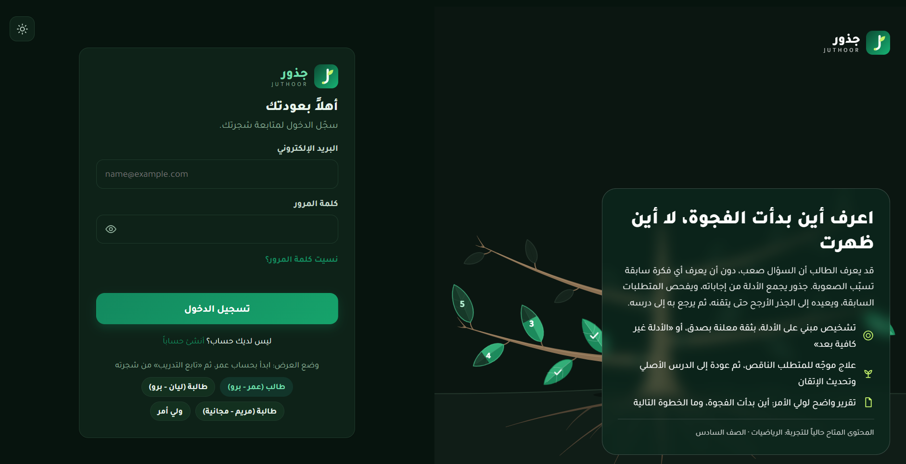

# Juthoor | جذور

> **Adaptive learning that looks beneath the mistake.**

Juthoor is a B2C adaptive learning platform designed to identify **where a learning gap is most likely to have started**, rather than stopping at the student's visible mistake.

When a learner struggles with a skill, Juthoor gathers evidence across prerequisite skills, evaluates competing explanations, and can withhold a root diagnosis when the evidence is insufficient. When the evidence is strong enough, the system identifies the most likely prerequisite gap, explains the reasoning, provides targeted remediation, and returns the learner to the original skill for verification.

The current MVP demonstrates this workflow using Grade 6 mathematics content based on the Jordanian curriculum.

---

## The Problem

A wrong answer tells us **where the error appeared**.

It does not always tell us **where the learning gap began**.

A student may struggle with a current lesson because a prerequisite skill was never fully mastered. Treating every mistake as a problem with the current lesson can lead to repeated practice without addressing the underlying gap.

Juthoor focuses on the question:

> **Where did the gap most likely start?**

---

## What Juthoor Does

Juthoor follows an evidence-first learning workflow:

```text
Student Attempt
      ↓
Answer Evaluation
      ↓
Evidence Collection
      ↓
Prerequisite Investigation
      ↓
Is the evidence sufficient?
      ├── No → Continue Investigation
      └── Yes
             ↓
      Most Likely Root Gap
             ↓
        Targeted Remediation
             ↓
       Return to Original Skill
             ↓
          Verification
````

The system does not claim to know an absolute causal truth.

Instead, it estimates the **most likely root gap given the observed evidence and the assumed prerequisite graph**.

---

## Core MVP

### Adaptive Questioning

Questions are selected according to the learner's current state and observed performance.

### Evidence-First Diagnosis

The system gathers evidence across prerequisite skills before committing to a root-gap hypothesis.

### Insufficient-Evidence Behavior

Juthoor can avoid premature diagnosis and continue gathering evidence when the available evidence is not strong enough.

### Competing Candidates

When more than one prerequisite may explain the observed difficulty, the system can keep competing candidates in consideration instead of forcing an unsupported conclusion.

### Targeted Remediation

Once a likely root gap is identified, the learner is redirected to focused remediation.

### Return & Verification

After remediation, the learner returns to the original skill so the system can verify whether the intervention helped.

### Mastery Tracking

Learner state and mastery are updated throughout the workflow.

### Explainable Feedback

The product presents the diagnosed issue together with supporting evidence and confidence information.

### Optional AI Tutor

AI-assisted tutoring is available as a supporting capability. The core adaptive and diagnostic workflow does not depend on the AI tutor to perform its fundamental learning-state and diagnosis logic.

---

## Current MVP Scope

The architecture is designed to be extensible across subjects and grade levels.

The current live/demo content is intentionally focused on:

* **Domain:** Mathematics
* **Curriculum context:** Jordanian Grade 6
* **Live skills demonstrated:** 9
* **Primary scenario:** prerequisite-gap investigation and remediation

This is a focused MVP scope rather than a claim of complete curriculum coverage.

---

## Product Flow

A typical learner interaction looks like this:

1. The learner practices a target skill.
2. The learner makes an error.
3. Juthoor evaluates the response and updates learner state.
4. The system investigates relevant prerequisite skills.
5. Evidence is accumulated across the prerequisite graph.
6. If evidence is insufficient, investigation continues.
7. If evidence is sufficient, the most likely root gap is identified.
8. The learner receives targeted remediation.
9. The system returns to the original skill.
10. The learner is evaluated again.

---

## Dashboard Preview



*Main learner dashboard of the current MVP.*

---

## Technical Architecture

At a high level:

```text
┌──────────────────────┐
│      Frontend        │
│   Learner Interface  │
└──────────┬───────────┘
           │
           ▼
┌──────────────────────┐
│      FastAPI API     │
│  Routers / Validation│
└──────────┬───────────┘
           │
           ▼
┌──────────────────────┐
│       Services       │
│ Session / Plans /    │
│ Persistence / Bridge │
└──────────┬───────────┘
           │
           ▼
┌──────────────────────────────┐
│ Adaptive & Diagnostic Engine │
│                              │
│ • Adaptive Questioning       │
│ • BKT / Mastery              │
│ • Evidence Collection        │
│ • Root-Gap Diagnosis         │
│ • Remediation                │
└──────────┬───────────────────┘
           │
           ▼
┌──────────────────────┐
│      PostgreSQL      │
│  Persistent State    │
│  Evidence / Sessions │
└──────────────────────┘

Supporting integrations:
AI Tutor • Payments • Email
```

[View System Architecture](submission/Docs/Juthoor_System_Architecture.png)

---

## Technology Stack

| Layer                    | Technology                           |
| ------------------------ | ------------------------------------ |
| Backend                  | FastAPI                              |
| ORM / Persistence        | SQLAlchemy                           |
| Database                 | PostgreSQL                           |
| Authentication           | JWT                                  |
| Password Security        | bcrypt                               |
| Adaptive Learning        | Custom adaptive engine               |
| Mastery Model            | Bayesian Knowledge Tracing (BKT)     |
| Knowledge Representation | Prerequisite graph                   |
| Graph Validation         | NetworkX                             |
| Validation / Testing     | pytest + integration / E2E suites    |
| AI                       | Optional LLM-based tutor integration |
| Payments                 | Optional Stripe integration          |

The MVP keeps the core learning and diagnostic workflow independent from optional external services where possible.

---

## Diagnostic Approach

Juthoor uses an explicit prerequisite graph and evidence rules rather than treating every mistake as a direct diagnosis.

The system considers:

* learner answer history
* correctness patterns
* prerequisite relationships
* repeated errors
* evidence sufficiency
* competing candidate explanations
* learner mastery state

A diagnosis is only declared when the evidence meets the implemented decision rules.

Otherwise, the system can return an **insufficient-evidence** state and continue investigation.

---

## Mastery Tracking

The adaptive engine uses Bayesian Knowledge Tracing (BKT) to maintain a learner mastery estimate.

The implementation includes:

* initial mastery probability
* learning probability
* slip probability
* guess probability
* bounded numerical state
* repeated state updates

The engine maintains learner mastery within valid numerical bounds and guards against invalid values such as NaN and infinity.

---

## Knowledge Graph

The MVP uses a prerequisite graph to represent relationships between learning skills.

The graph supports:

* prerequisite traversal
* candidate investigation
* validation of prerequisite references
* cycle detection
* diagnosis reasoning

The current graph contains the skills implemented in the live content pack.

The software verifies graph integrity programmatically; pedagogical validation of prerequisite relationships remains a separate limitation of the current MVP.

---

## Security & Data Isolation

Juthoor includes authentication and authorization controls for the main user flows.

The current authorization model supports:

* student self-access
* parent access to linked children
* protected administrative functionality
* token validation
* invalid and expired token handling
* student data isolation

The project also contains automated authorization and isolation tests covering relevant access-control scenarios.

---

## Testing & Reliability

The latest verified project validation is:

```text
Pytest:
829 passed
0 failed

Preflight:
44/44 checks passed
```

Testing covers multiple aspects of the MVP, including:

* core workflow behavior
* API behavior
* authentication and authorization
* student isolation
* persistence
* diagnosis behavior
* mastery invariants
* edge cases
* regression protection
* end-to-end scenarios
* preflight validation

Passing automated tests demonstrate implementation behavior and regression coverage; they do not by themselves establish educational efficacy or real-world diagnostic accuracy.

---

## Diagnostic Benchmark

The repository includes labelled diagnostic evaluation scenarios designed to test behaviors such as:

* correct root identification
* insufficient-evidence handling
* competing candidates
* premature diagnosis prevention
* deterministic behavior

Where benchmark scenarios are simulated, they are treated as **engineering validation**, not as evidence of real-world student diagnostic accuracy.

The current project does not claim a specific real-world diagnostic accuracy percentage.

---

## Current Limitations

The MVP is intentionally focused.

Current limitations include:

* limited live content coverage
* limited real-student longitudinal data
* no claim of real-world diagnostic accuracy from the simulated benchmark
* prerequisite relationships are software-validated but may require additional independent pedagogical review
* BKT parameters and evidence thresholds are implemented defaults rather than fully calibrated production models
* long-term educational efficacy has not yet been established through controlled studies
* the system is an MVP and is not positioned as a production-scale deployment

These limitations are intentionally documented rather than hidden.

---

## Why This MVP Is Focused

The goal of this stage is not to build every possible education feature.

The MVP focuses on one core loop:

> **Detect → Investigate → Diagnose → Remediate → Return → Verify**

This keeps the implementation centered on the main product hypothesis:

> A learning system can do more than identify the visible mistake; it can investigate prerequisite evidence and guide the learner toward the most likely root gap.

---

## Submission Materials

### Presentation

[Judging Presentation — PDF](submission/Docs/Juthoor_MVP_Judging_Presentation.pdf)

### Technical Documentation

[Technical Documentation — PDF](submission/Docs/Juthoor_MVP_Technical_Documentation.pdf)

### Architecture

[System Architecture Diagram](submission/Docs/Juthoor_System_Architecture.png)

### Demo

[Demo Video](submission/Demo/Juthoor_Demo.mp4)

### License

[View License](LICENSE)

---

## Additional Project Materials

The repository also contains supporting engineering and project files, including:

* test suites
* diagnostic benchmarks
* migration files
* scripts
* deployment configuration
* final audit and handoff materials
* business and validation work

See the repository structure for the complete implementation.

---

## Project Structure

```text
Juthoor/
├── app/                    # Backend application
├── benchmarks/             # Diagnostic / evaluation scenarios
├── migrations/             # Database migrations
├── scripts/                # Setup, seed and validation scripts
├── tests/                  # Automated tests
├── submission/             # Final judging materials
│   ├── Demo/
│   └── Docs/
├── bootcamp tasks/         # Supporting project deliverables
├── Dockerfile
├── docker-compose.yml
├── pyproject.toml
├── pytest.ini
├── requirements.txt
├── requirements-dev.txt
├── requirements-optional.txt
├── run_demo.py
└── README.md
```

---

## Running the MVP Locally

### Requirements

* Python 3.11+
* PostgreSQL
* Node.js 18+ for JavaScript/UI test tooling where applicable

### Setup

```bash
python -m venv .venv
```

Windows:

```powershell
.venv\Scripts\activate
```

Install dependencies:

```bash
python -m pip install -r requirements-dev.txt
```

Create the environment file:

```powershell
Copy-Item .env.example .env
```

Configure the required database and application settings in `.env`.

### Run the Demo Environment

```bash
python run_demo.py
```

The local application is served through the demo runner when the required environment and database configuration are available.

---

## Validation Commands

Run the automated tests:

```bash
python -m pytest -q
```

Run the project preflight:

```bash
python scripts/preflight.py
```

The latest verified run for the submitted revision is:

```text
829 passed
0 failed

44/44 preflight checks passed
```

---

## Team

**Juthoor | جذور**

* Marah Alkilani
* Bayan Marashdeh
* Sadeen Nababteh
* Rana Alshalout

---

## Project Links

* [Presentation](submission/Docs/Juthoor_MVP_Judging_Presentation.pdf)
* [Technical Documentation](submission/Docs/Juthoor_MVP_Technical_Documentation.pdf)
* [Architecture Diagram](submission/Docs/Juthoor_System_Architecture.png)
* [Demo Video](submission/Demo/Juthoor_Demo.mp4)
* [License](LICENSE)

---

## Final Note

Juthoor does not aim to replace the teacher, nor does it claim to know the absolute cause of every learning error.

Its MVP focuses on a narrower and measurable workflow:

> **When a learner struggles, investigate the prerequisites, gather evidence, estimate the most likely root gap, remediate it, and verify the result.**

That workflow is the core of the current MVP.
